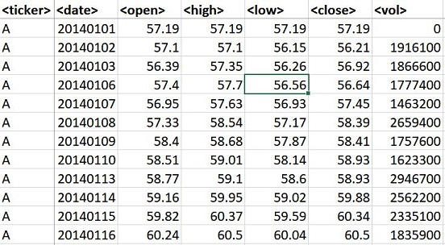
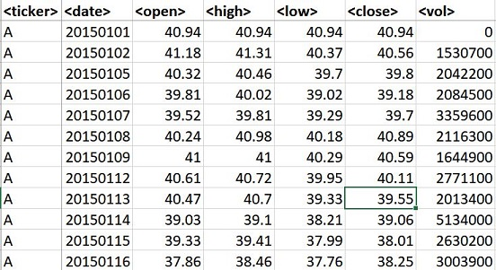
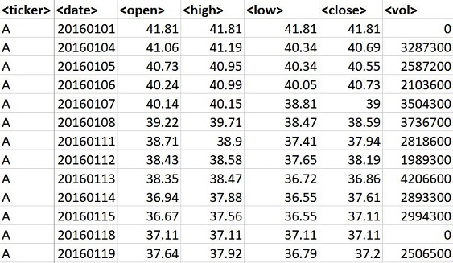
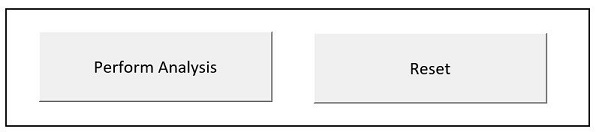

# Stock Market Analysis

## Background
In this project, I am analyzing 3,000 distinct real stock market data. The dataset contains 3 separate tabs with daily data for 2014, 2015 and 2016:

 * Ticker
 * Date (daily)
 * Open (Prices)
 * High (Prices)
 * Low (Prices)
 * Close (Prices)
 * Volume
 
 
 

The origin data (Columns A through G) and analysis (Columns I through N) can be found in the same file at [Stock_Analysis.csv](Multiple_year_stock_data.xlsm)

## Technologies Used
   * VBA

## Summary of Steps

* Creating a script that loops through all the stocks on every worksheet and return the following information:

  * Ticker Symbol
  
  * Yearly change between Open and Close Prices for each stock for each year.

  * Percent change between Open and Close Prices for each stock for each year.

  * The total Volume of the stock for the year
  
  * Open Values
  
  * Close Values

* Conditional formatting that highlights positive change in green and negative change in red.

* Two buttons can be found in the "Buttons tab":
  
  * "Perform Analysis" to run the script and see the output
  * "Reset" to clear the result
 

